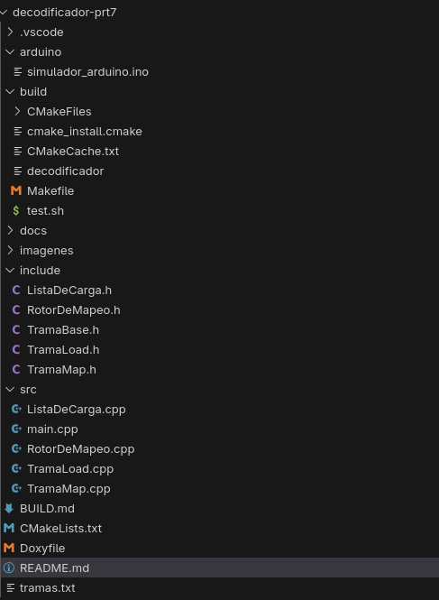
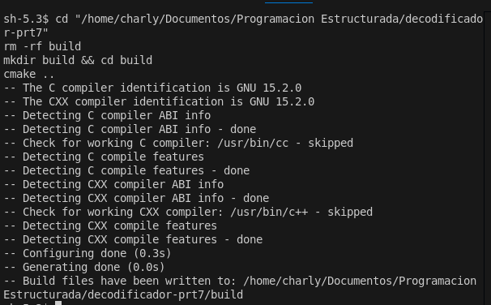
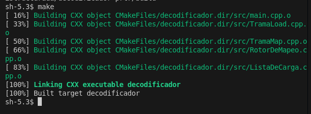
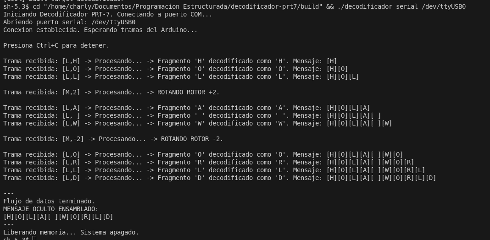
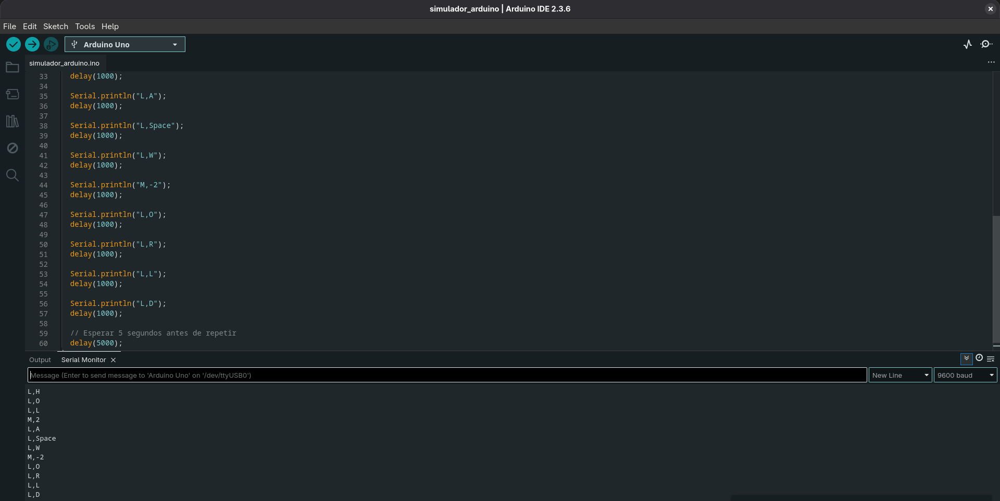
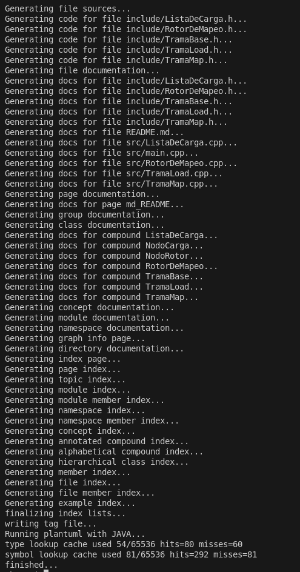

# Reporte - Decodificador de Protocolo PRT-7

**Autor:** Carlos Vargas  
**Fecha:** 6 de Noviembre de 2025  

---

## 1. Introducción

### ¿Qué es el Proyecto?

Este proyecto es un programa que decodifica mensajes secretos enviados por un Arduino. El Arduino no envía el mensaje completo, sino que envía piezas del mensaje y instrucciones para armarlo.

### ¿Cómo Funciona?

El Arduino envía dos tipos de mensajes:

1. **Tramas LOAD (L,X)**: Son pedazos del mensaje (letras)
2. **Tramas MAP (M,N)**: Son instrucciones que cambian cómo se leen las letras

Por ejemplo:
- `L,H` → Guardar la letra 'H'
- `M,2` → Rotar el "disco de cifrado" 2 posiciones
- `L,A` → Guardar la letra 'A' (pero ahora puede significar otra cosa)

### ¿Qué Hace el Programa?

El programa:
- Lee las tramas que envía el Arduino
- Tiene un "rotor" (como una rueda con todas las letras del alfabeto)
- Cuando recibe `M,2`, rota la rueda 2 posiciones
- Cuando recibe `L,A`, decodifica la letra según la posición actual de la rueda
- Al final, muestra el mensaje completo decodificado

### Ejemplo Sencillo

**Entrada del Arduino:**
```
L,H
L,O
L,L
M,2        ← Aquí rota la rueda
L,A
```

**Salida del Programa:**
```
MENSAJE DECODIFICADO: H O L A
```


---

## 2. Manual Técnico

### 2.1 Diseño del Sistema

El programa está dividido en varias partes:

#### Clases Principales

**1. TramaBase (Clase Padre)**
- Es la plantilla para todas las tramas
- Define que toda trama debe tener un método `procesar()`

**2. TramaLoad (Carga de Datos)**
- Guarda un carácter (una letra)
- Cuando se procesa, decodifica la letra y la guarda en la lista

**3. TramaMap (Rotación)**
- Guarda un número (cuánto rotar)
- Cuando se procesa, rota el rotor ese número de posiciones

**4. RotorDeMapeo (El Disco de Cifrado)**
- Es una lista circular con todas las letras: A → B → C → ... → Z → (vuelve a A)
- Puede rotar hacia adelante o hacia atrás
- Decodifica las letras según su posición actual

**5. ListaDeCarga (Almacén del Mensaje)**
- Guarda las letras decodificadas en orden
- Al final, imprime el mensaje completo

### 2.2 Cómo Funciona Internamente

```
1. El programa lee una línea (ej: "L,H" o "M,2")
2. Determina qué tipo de trama es
3. Crea el objeto correspondiente (TramaLoad o TramaMap)
4. Ejecuta el método procesar()
5. Libera la memoria
6. Repite hasta terminar todas las tramas
```

### 2.3 El Rotor de Mapeo Explicado

Imagina una rueda con las letras del alfabeto:

```
Estado inicial:
A → B → C → D → E → F ... → Z → (vuelve a A)
^
Cabeza (posición 0)
```

Si llega `M,2` (rotar 2 posiciones):
```
A → B → C → D → E → F ... → Z → (vuelve a A)
          ^
          Cabeza (ahora en C)
```

Ahora, cuando llega `L,A`, la letra 'A' se mapea de forma diferente porque la cabeza está en 'C'.

### 2.4 Estructura de Archivos

```
decodificador-prt7/
├── include/              Archivos .h (declaraciones)
│   ├── TramaBase.h
│   ├── TramaLoad.h
│   ├── TramaMap.h
│   ├── RotorDeMapeo.h
│   └── ListaDeCarga.h
├── src/                  Archivos .cpp (código)
│   ├── main.cpp
│   ├── TramaLoad.cpp
│   ├── TramaMap.cpp
│   ├── RotorDeMapeo.cpp
│   └── ListaDeCarga.cpp
├── arduino/              Código para Arduino
│   └── simulador_arduino.ino
├── build/                Carpeta de compilación
│   └── decodificador     ← Programa ejecutable
├── imagenes/             Capturas de pantalla
├── CMakeLists.txt        Archivo para compilar
└── tramas.txt            Archivo de prueba
```

**📸 CAPTURA 1: Estructura del proyecto**



*Cómo tomar la captura: Abre el explorador de archivos en VS Code (Ctrl+Shift+E) y toma una captura de la estructura de carpetas*

---

### 2.5 Componentes del Sistema

**Entrada de Datos:**
- Lee desde un archivo de texto (simulación)
- O desde el puerto serial del Arduino (real)

**Procesamiento:**
- Parsea cada línea para identificar el tipo de trama
- Crea objetos dinámicos (usando `new`)
- Ejecuta la lógica de decodificación

**Salida:**
- Muestra en pantalla el progreso
- Al final muestra el mensaje completo decodificado

---

## 3. Capturas de Pantalla

### 3.1 Compilación del Proyecto

**📸 CAPTURA 2: Configuración con CMake**



*Cómo tomar la captura: Ejecuta `cmake ..` en la terminal y captura la salida*

```bash
$ cd decodificador-prt7
$ mkdir build && cd build
$ cmake ..
```

---

**📸 CAPTURA 3: Compilación con Make**



*Cómo tomar la captura: Ejecuta `make` en la terminal y captura la salida completa*

```bash
$ make
```

---

### 3.2 Ejecución del Programa

**📸 CAPTURA 4: Ejecución y Decodificación**



*Cómo tomar la captura: Ejecuta `./decodificador ../tramas.txt` y captura toda la salida hasta el mensaje final*

```bash
$ ./decodificador ../tramas.txt
```


### 3.3 Código del Arduino

**📸 CAPTURA 6: Código Arduino**



*Cómo tomar la captura: Abre el archivo `arduino/simulador_arduino.ino` en VS Code y captura el código*

---

### 3.4 Documentación Doxygen

**📸 CAPTURA 7: Generación de Documentación**



*Cómo tomar la captura: Ejecuta `doxygen Doxyfile` en la terminal y captura la salida*

```bash
$ doxygen Doxyfile
```

---

---

## 4. Conclusiones

### Lo que se Logró

✅ El programa funciona correctamente y decodifica mensajes  
✅ Se implementaron todas las clases requeridas  
✅ La memoria se gestiona sin fugas (cada `new` tiene su `delete`)  
✅ El código está documentado con Doxygen  
✅ Se puede compilar con CMake de forma redistribuible  
✅ Funciona con archivo de texto y puede adaptarse a Arduino real  

### Lo que se Aprendió

- Cómo usar herencia y polimorfismo en C++
- Cómo crear listas enlazadas sin usar librerías (STL)
- La importancia de los destructores virtuales
- Cómo funciona un cifrado tipo César dinámico
- Manejo de memoria con punteros (`new` y `delete`)

### Resultado Final

**Mensaje Decodificado:** "HOLA WORLD"

El programa cumple con todos los requisitos pedidos en las instrucciones.

---

**Fin del Reporte**
